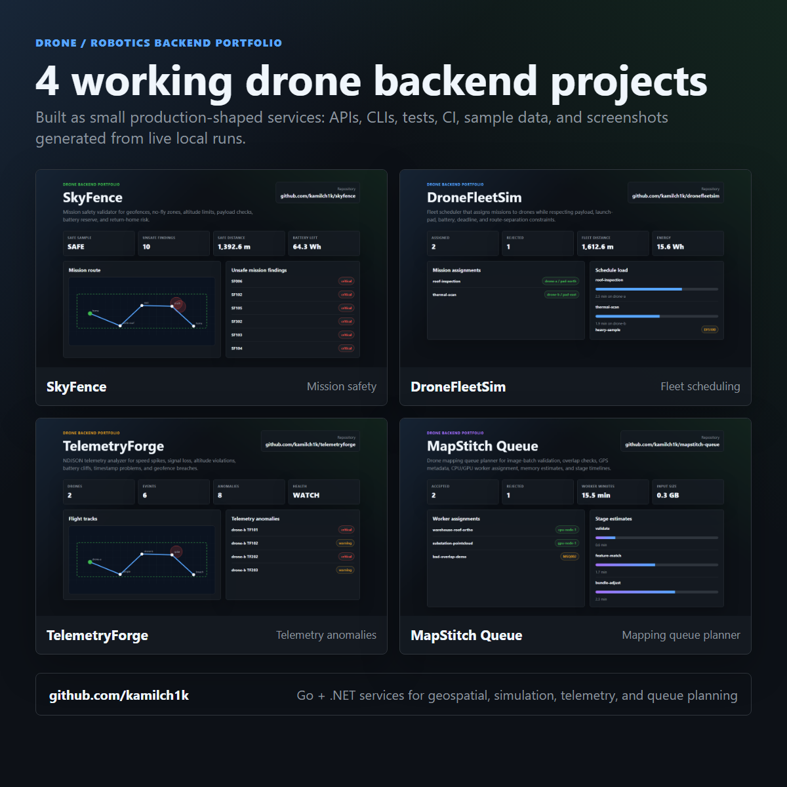
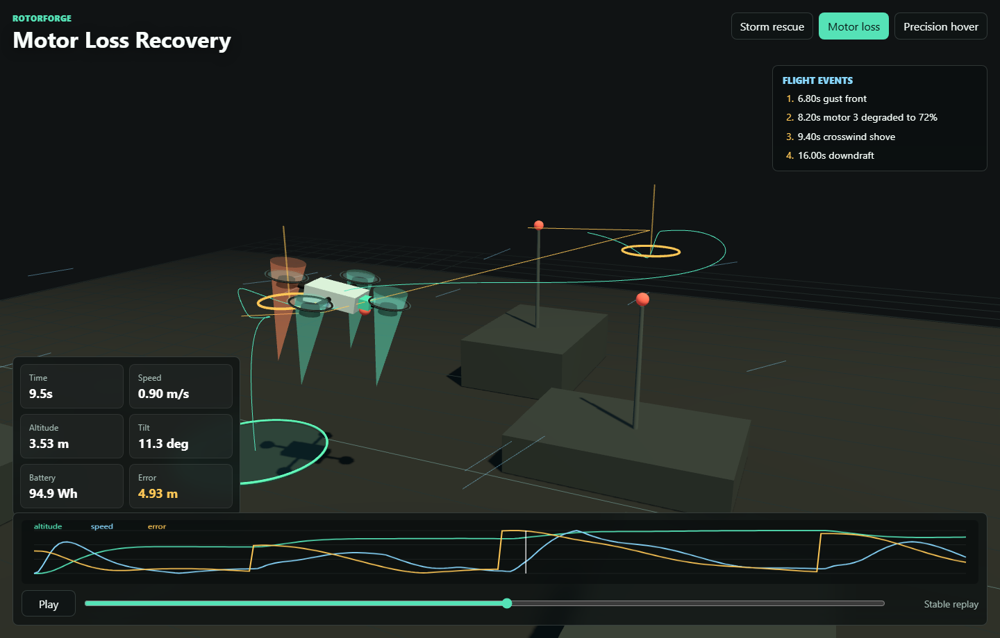
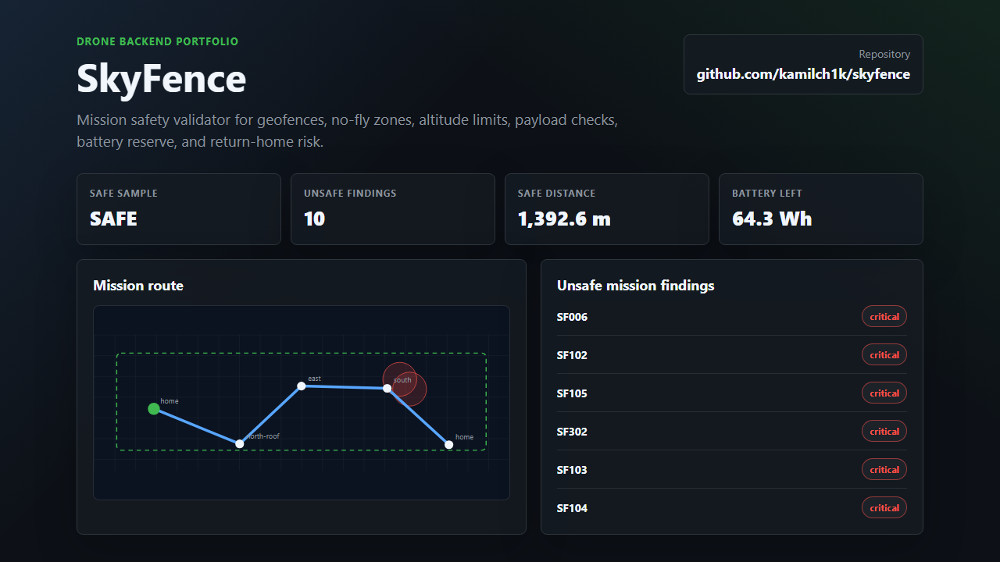
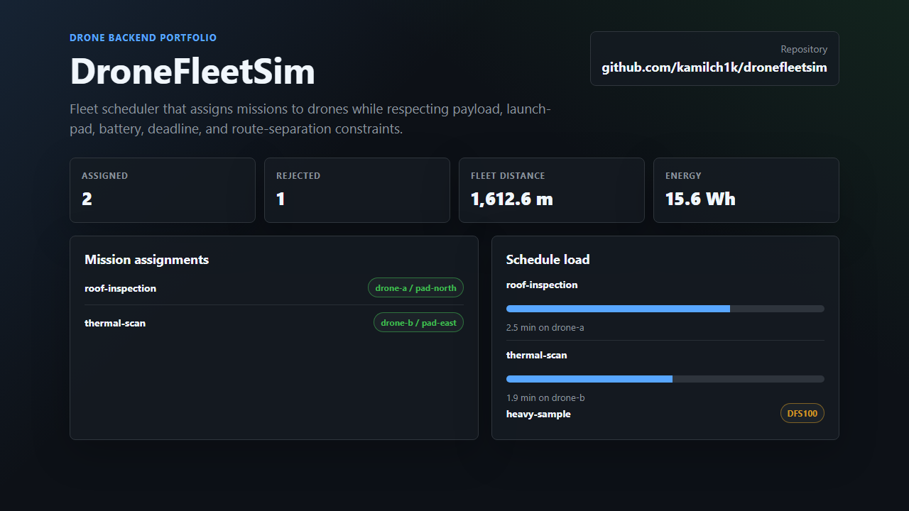
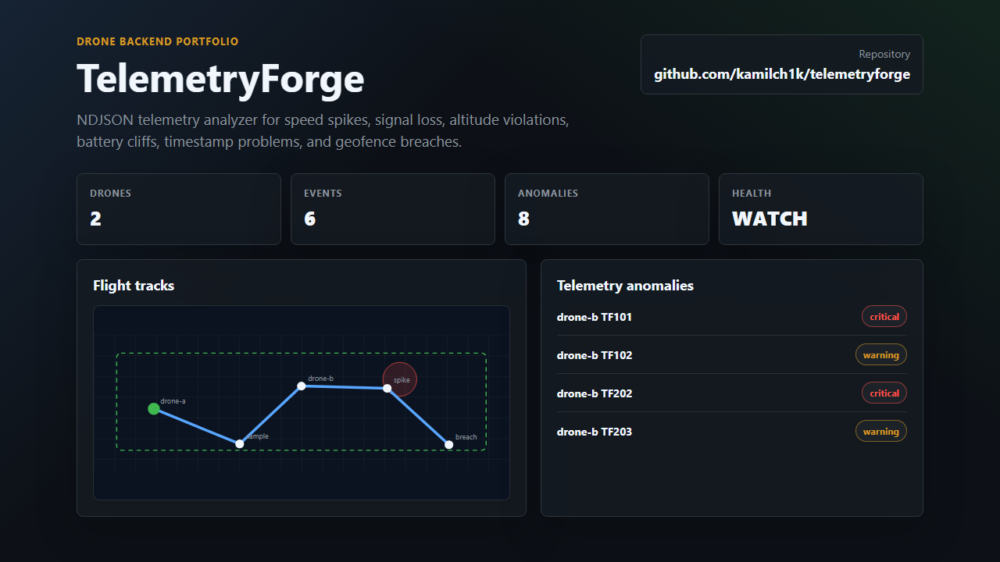
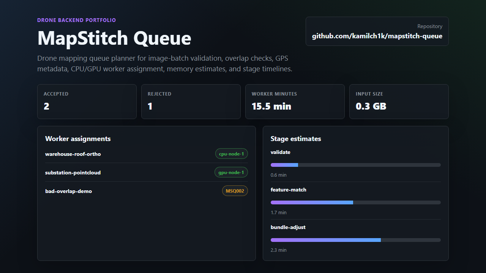

# kamilch1k

Backend-focused developer building practical systems in .NET, Go, and TypeScript, with a growing focus on reliability, security, data-heavy APIs, geospatial workflows, and simulation tools.

I like projects that have a real backend shape: authentication, idempotency, concurrency, outbox-style workflows, metrics, tests, and local verification scripts. Right now I am building a portfolio around APIs and services that can be cloned, run, tested, and discussed in interviews.

## Featured backend projects

| Project | Stack | What it shows |
| --- | --- | --- |
| [settlement-recon](https://github.com/kamilch1k/settlement-recon) | Go, HTTP, CSV | Deterministic payment settlement reconciliation, mismatch classification, strict CSV parsing, CLI/API workflows, sample data, tests, Docker, CI |
| [cacheguard](https://github.com/kamilch1k/cacheguard) | ASP.NET Core, .NET | Resilient API gateway demo with rate limiting, request coalescing, circuit breaker, stale cache fallback, tests, Docker, CI |
| [migrationsafe](https://github.com/kamilch1k/migrationsafe) | Go, PostgreSQL, SQL | Migration safety checker for destructive DDL, unsafe indexes, locking risks, text/JSON reports, sample migrations, tests, Docker, CI |
| [ledgerline](https://github.com/kamilch1k/ledgerline) | Go, PostgreSQL | Idempotent double-entry ledger, concurrency-safe transfers, no-overdraft guarantees, real Postgres tests |
| [signalforge](https://github.com/kamilch1k/signalforge) | ASP.NET Core, SQLite, GitHub API | Maps backend vacancies to open-source proof opportunities, explains scoring, tracks proof actions with idempotency keys, ships with UI, CI, Docker, tests |
| [oss-scout](https://github.com/kamilch1k/oss-scout) | ASP.NET Core, Go | Scores open-source issues by fit, recency, labels, backend signals, and contribution risk with tests and a Go worker |
| [vacancy-signal-radar](https://github.com/kamilch1k/vacancy-signal-radar) | ASP.NET Core, Go, SQLite | Scores backend job postings and persists apply/watch/skip decisions with idempotency-key protection |
| [job-application-tracker-api](https://github.com/kamilch1k/job-application-tracker-api) | ASP.NET Core, EF Core | Auth, user-owned resources, migrations, dashboard queries, reminders, integration tests |
| [mixed-order-ledger-system](https://github.com/kamilch1k/mixed-order-ledger-system) | .NET, Go | Order API, durable outbox events, Go worker processing, ledger entries, end-to-end local verification |
| [go-url-shortener-api](https://github.com/kamilch1k/go-url-shortener-api) | Go | Short links, redirects, click analytics, rate limiting, metrics, HTTP tests |
| [variantlens](https://github.com/kamilch1k/variantlens) | ASP.NET Core, .NET | A/B experiment analysis API with confidence intervals, sequential guardrails, revenue-risk checks, Docker, CI, and sample payloads |
| [repoguard](https://github.com/kamilch1k/repoguard) | Go, HTTP, CLI | Agent-first security scanner with SARIF, OpenAPI, GitHub Action, SDK examples, MCP-style tool server, secret/MCP/agent config checks |

## Drone and robotics backend projects

| Project | Stack | What it shows |
| --- | --- | --- |
| [rotorforge](https://github.com/kamilch1k/rotorforge) | Go, Three.js, WebGL | 6-DOF quadcopter physics simulator with motor lag, wind fields, fault-tolerant motor allocation, API/CLI telemetry, and hosted replay viewer |
| [skyfence](https://github.com/kamilch1k/skyfence) | Go, HTTP, CLI | Drone mission safety validator for geofences, no-fly zones, altitude limits, payload, battery reserve, and return-home risk |
| [dronefleetsim](https://github.com/kamilch1k/dronefleetsim) | ASP.NET Core, .NET | Fleet scheduling simulator with payload, battery, launch-pad, deadline, and route-separation constraints |
| [telemetryforge](https://github.com/kamilch1k/telemetryforge) | Go, HTTP, CLI | NDJSON telemetry analyzer for speed spikes, signal loss, altitude violations, battery drain, and geofence breaches |
| [mapstitch-queue](https://github.com/kamilch1k/mapstitch-queue) | ASP.NET Core, .NET | Drone mapping queue planner with image-batch validation, CPU/GPU worker assignment, memory estimates, and stage timelines |

## Scientific and infrastructure projects

| Project | Stack | What it shows |
| --- | --- | --- |
| [impulselab](https://github.com/kamilch1k/impulselab) | Go, HTTP, CLI | Deterministic 2D rigid-body physics engine with impulse collision response, friction/restitution, energy metrics, samples, tests, Docker, CI |
| [orbitforge](https://github.com/kamilch1k/orbitforge) | ASP.NET Core, .NET | N-body orbital simulation backend with velocity-Verlet integration, conservation metrics, close-approach events, CLI/API, samples, tests, Docker, CI |
| [shardlab](https://github.com/kamilch1k/shardlab) | Go, HTTP, CLI | Distributed sharding simulator comparing modulo, consistent, and rendezvous hashing under topology changes and hot-key workloads |
| [queuescope](https://github.com/kamilch1k/queuescope) | ASP.NET Core, .NET | Queue capacity planning with Erlang C, deterministic Monte Carlo simulation, SLO breach estimates, and API smoke tests |
| [driftwatch](https://github.com/kamilch1k/driftwatch) | Go, HTTP, CLI | Streaming anomaly and drift detection with rolling median/MAD, EWMA, Page-Hinkley-style checks, and reproducible fixtures |
| [streamsketch](https://github.com/kamilch1k/streamsketch) | Go, HTTP, CLI | Approximate stream analytics using HyperLogLog-style distinct counts and Count-Min Sketch heavy hitters |
| [evalpulse](https://github.com/kamilch1k/evalpulse) | ASP.NET Core, .NET | AI eval/observability backend with golden datasets, regression gates, drift reports, and cost/latency budgets |

## Drone project screenshots

Generated from live local API runs against the sample mission, fleet, telemetry, and mapping payloads.

| RotorForge |
| --- |
|  |

| SkyFence | DroneFleetSim |
| --- | --- |
|  |  |

| TelemetryForge | MapStitch Queue |
| --- | --- |
|  |  |

## What I am sharpening

- Backend APIs with clean contracts and useful tests
- Idempotency, concurrency, and failure recovery
- Event-driven flows that are understandable without heavy infrastructure
- Local developer experience: seed data, smoke tests, docs, and CI

## Current focus

Building portfolio projects that are small enough to understand quickly but real enough to discuss deeply: why the data model works, how failures are handled, what the tests prove, and where the system would go next in production.
